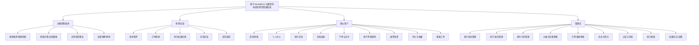

```mermaid
flowchart TB
  A["基于SpringBoot+大模型的电影院购票管理系统"]

  %% 列：管理员
  subgraph COL_ADMIN_M[ ]
    direction TB
    AdminM["管理员"]
    ad1[影片信息管理]
    ad2[影厅/座位管理]
    ad3[排片计划管理]
    ad4[价格与优惠管理]
    ad5[订单/退款审核]
    ad6[会员与积分]
    ad7[公告与消息]
    ad8[统计报表]
    ad9[权限/日志/设置]
  end
  style COL_ADMIN_M fill:#ffffff,stroke:#ffffff

  %% 列：观众用户
  subgraph COL_USER_M[ ]
    direction TB
    UserM["观众用户"]
    u1[首页/检索]
    u2[个人中心]
    u3[影片浏览]
    u4[在线选座]
    u5[下单与支付]
    u6[电子票/核销码]
    u7[退票改签]
    u8[评价与收藏]
    u9[客服工单]
  end
  style COL_USER_M fill:#ffffff,stroke:#ffffff

  %% 列：售票/运营
  subgraph COL_STAFF_M[ ]
    direction TB
    StaffM["售票/运营"]
    s1[现场售票]
    s2[订单核销]
    s3[场次变更处理]
    s4[异常应急]
    s5[库存监控]
  end
  style COL_STAFF_M fill:#ffffff,stroke:#ffffff

  %% 列：大模型智能体
  subgraph COL_AI_M[ ]
    direction TB
    AIM["大模型智能体"]
    ai1[观影推荐/联想检索]
    ai2[智能问答/自助客服]
    ai3[异常风控建议]
    ai4[运营洞察/预测]
  end
  style COL_AI_M fill:#ffffff,stroke:#ffffff

  A --> AdminM
  A --> UserM
  A --> StaffM
  A --> AIM

  AdminM --> ad1
  AdminM --> ad2
  AdminM --> ad3
  AdminM --> ad4
  AdminM --> ad5
  AdminM --> ad6
  AdminM --> ad7
  AdminM --> ad8
  AdminM --> ad9

  UserM --> u1
  UserM --> u2
  UserM --> u3
  UserM --> u4
  UserM --> u5
  UserM --> u6
  UserM --> u7
  UserM --> u8
  UserM --> u9

  StaffM --> s1
  StaffM --> s2
  StaffM --> s3
  StaffM --> s4
  StaffM --> s5

  AIM --> ai1
  AIM --> ai2
  AIM --> ai3
  AIM --> ai4
```